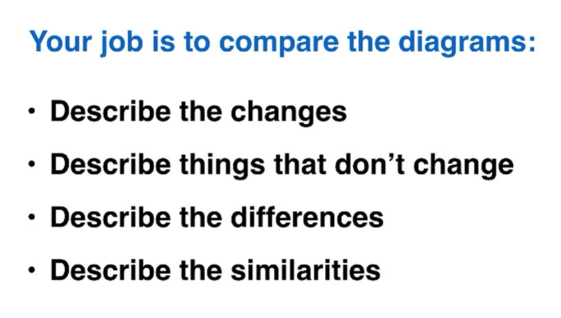

## Task2

1. Understanding the task
   - task response
   - coherence and cohesion
   - vocabulary
   - grammer

2. Break the task into parts
   - 250 words
   - 4 paragraphs
   - about 13 sentences
     1. introduction(2 sentences)
     1. 2 main paragraphs(5 sentences each)
     3. conclusion(1 sentence)
   - 40 minutes
     0. planning(10 minutes)
     0. introduction(5 minutes)
     0. main body(10 + 10)
     0. conclusion(5 minutes)

4 types:

### Introduction

2 sentences 30~40 words

- **introduce the topic**
- **give a general answer**

#### Discussion

#### Opinion

#### Problem and solution

#### Two-part question

### Main body paragraphs

- 2 paragraphs
- 5 sentences in each
- 90 to 100 words each

2 types:

### conclusions

2 easy rules:

- never write anything new（概括自己前面写的内容就行了，不要有新的观点）
- 1 sentence：repeat，summarise

#### Discussion （+ opinion）

#### Opinion

#### Problem and solution

#### 2-part question

### Planning

3 step essay planning

brainstorm

organize

### full Opinion essay

## Task 1

1. introduction: 1 sentence
2. overview: 2 sentences, 2 main points
3. details maybe3？
4. details maybe3？

no conclusion

### Line graphs

#### Careful！！！

### bar charts

### pie charts

**好词：**

five categories

信息描述准确点，不要说什么什么is 34%

### tables

### two different charts

好词

according to the bar chart

looking at the age profile pie chart	

to be precise

with 加数字

### process diagram

four distinct stages

### comparison diagram

可以在overview部分说一个改变的和一个没改变的

个人感觉同义替换很重要

### summary

